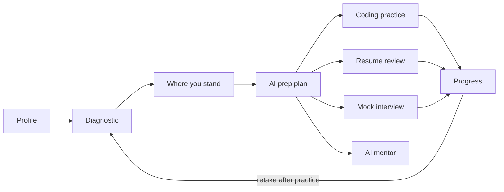
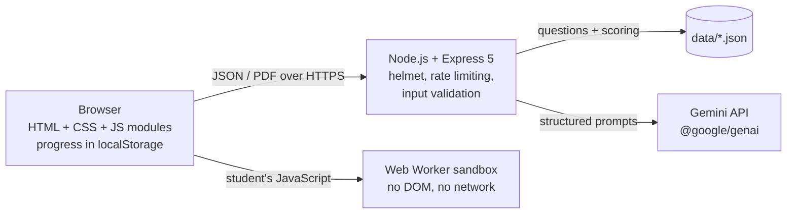

# Placement Navigator

**PromptWars × GDG On Campus – CIT · 26 September 2026**

> *Challenge:* many students struggle to understand **what to prepare, how to prepare, where they stand, and what they need to improve** for placements.

Placement Navigator is a web app that answers those four questions for each student:
- it checks where you stand;
- it builds a plan from your weakest areas;
- you practise coding with real test runs, resume reviews and full mock interviews;
- an AI mentor knows your results.

## How it answers the challenge

| Student's question | What Placement Navigator does |
|---|---|
| **Where do I stand?** | A 20-question diagnostic (Aptitude, DSA, CS Fundamentals, Communication), scored on the server. Shows a score per area, your strongest area and a "focus first" area |
| **What should I prepare?** | Gemini builds a plan from *your* scores, target role, company type and hours per week |
| **How should I prepare?** | A week-by-week checklist and a daily habit, sized to the weeks left before your placement month. An AI mentor answers follow-up questions using your data |
| **Can I code it?** | 8 classic placement problems. JavaScript solutions run against 45 real test cases in the browser, with a 2-second time limit per test. Python, Java and C++ get a Gemini code review, clearly labelled *not executed* |
| **Is my resume ready?** | Paste text or upload a PDF. You get a match score for your target role, missing keywords and rewritten lines (only lines that really exist in your resume) |
| **Can I answer in an interview?** | Single questions or a full 5-question interview (HR, Technical or Mixed). Each answer is scored on relevance, structure, clarity and depth, and the full interview ends with a report. Type or speak your answers; a filler-word counter tracks delivery |
| **Am I improving?** | A progress screen comparing each diagnostic with the previous one, plus coding problems solved, interview averages, last full-interview result, resume score change and plan completion |

## User flow



## Google technologies used

| Technology | Where it is used in this repo |
|---|---|
| **Gemini API** (Google AI) through the official **`@google/genai`** SDK | Every AI feature: `src/gemini.js` and the routes in `src/routes/` |
| Gemini **structured output** (`responseMimeType` + `responseJsonSchema`) | All 8 AI calls return JSON that matches a schema |
| Gemini **system instructions** | Each feature sets its own role and rules |
| Gemini **multi-turn chat** | The AI mentor sends the conversation as `user`/`model` turns |
| Gemini **document understanding** (PDF as `inlineData`) | Scanned resume PDFs are read by Gemini directly |
| Gemini **model fallback** (`gemini-flash-latest` → `gemini-2.5-flash` → `gemini-flash-lite-latest`) | `src/gemini.js`: keeps the app working when a model is overloaded |
| **Google AI Studio** | Where the `GEMINI_API_KEY` is created |
| **Google Cloud Run**, with Cloud Build, Artifact Registry and Secret Manager | Deployment target: see [Deploy to Google Cloud Run](#deploy-to-google-cloud-run) |

## How AI is used

| Feature | Endpoint | What Gemini is asked for | Guard rails in code |
|---|---|---|---|
| Prep plan | `POST /api/plan` | Priorities, weekly plan, daily habit, practice ideas from profile + scores | Weeks left is calculated in code; the student's name is never sent; output trimmed to expected fields |
| Resume review | `POST /api/resume/review` | Match score, strengths, missing keywords, before/after lines, next steps | Emails and phone numbers removed before sending; rewrites whose "before" text is not in the resume are dropped |
| Resume PDF | `POST /api/resume/review-pdf` | Text PDFs: same review. Scanned PDFs: Gemini transcribes the PDF first | Text is extracted on the server with `unpdf`; the transcript is redacted before the review call |
| Code review | `POST /api/coding/review` | Verdict, complexity, bugs, edge cases, hints | If the JavaScript was run, the real test result is included; otherwise the review says "not executed" |
| Interview question | `POST /api/interview/question` | One fresher-level HR or technical question, no repeats | Previously asked questions are passed in |
| Interview feedback | `POST /api/interview/feedback` | 1–5 scores (relevance, structure/STAR, clarity, depth), what worked, what to improve, a better answer | Scores clamped to 1–5; the answer is marked as data, not instructions |
| Interview report | `POST /api/interview/report` | Summary, strengths, focus areas, next steps across all answers | Averages and the verdict (Ready / Promising / Needs work) are calculated in code |
| AI mentor | `POST /api/mentor/chat` | A short, personalised answer plus follow-up questions | Only known context fields are accepted (never the name); limited to placement topics |

**Computed without AI** (fast, free and exact):
- diagnostic scoring and readiness level;
- running code against test cases;
- weeks until placements;
- word count, speaking time and filler words (*um, uh, like, basically, actually, you know, so*);
- interview report averages;
- progress changes and plan completion.

## Architecture



- **No database, no accounts.** A student's data stays in their own browser (`localStorage`). The Progress screen has a "Clear my data" button.
- **The API key stays on the server.** It is read from `GEMINI_API_KEY` and never sent to the browser.
- **Correct diagnostic answers stay on the server.** Questions are sent without answers, and scoring happens on the server.
- **Student code never runs on the server.** It runs in a Web Worker in the student's browser. The worker has its own Content Security Policy that blocks all network access, and it is stopped if a test takes longer than 2 seconds.

## Security and quality

- `helmet` security headers, including a strict Content Security Policy for pages (no inline scripts, no `eval`)
- AI endpoints limited to 20 requests per minute per client, all API routes to 120
- Every input validated (types, lengths, ranges, allowed values) with clear 400 messages; PDFs are checked for size (4 MB), file signature and page count (5)
- Resilient AI calls: if Gemini is overloaded (5xx) the call is retried once, then the fallback models are tried; 429 and 404 move to the next model at once. In testing, `gemini-flash-latest` returned 503 and 429 during busy periods and `gemini-2.5-flash` answered instead
- Safe error responses: no stack traces reach the browser, and a bad key, used-up quota, overloaded model or wrong model name gets a message that says what to fix
- All AI and user text is inserted with `textContent` (no `innerHTML`), so it cannot inject HTML
- Accessible:
  - labelled form fields, keyboard navigation and a skip link;
  - focus moves to each screen's heading;
  - `aria-live` status messages;
  - colour contrast of at least 5.4:1 for all text colours;
  - scores always shown as text, not colour alone.
- Works on phones (tested at 375 px wide), in light and dark mode

## Run locally

Requires **Node.js 22.9 or newer**.

```bash
git clone https://github.com/bharathykannan6/GDG_Placement-navigator.git
cd GDG_Placement-navigator
npm install
cp .env.example .env        # then paste your key from https://aistudio.google.com/apikey
npm start
```

Open http://localhost:8080. `npm run dev` does the same with auto-reload. Both read `.env` if it exists.
Without a key, the diagnostic, dashboard, coding test runner and progress screens still work; AI features show "AI is not configured".

| Variable | Required | Default | Purpose |
|---|---|---|---|
| `GEMINI_API_KEY` | for AI features | — | Gemini API key from Google AI Studio |
| `GEMINI_MODEL` | no | `gemini-flash-latest` | Main Gemini model |
| `GEMINI_FALLBACK_MODELS` | no | `gemini-2.5-flash,gemini-flash-lite-latest` | Tried in order when the main model is overloaded (5xx), rate-limited (429) or unavailable (404) |
| `PORT` | no | `8080` | Port to listen on (Cloud Run sets this) |

## Tests

```bash
npm test
```

46 tests use Node's built-in test runner and `supertest`, with a fake Gemini model, so they need no network or key. They cover:
- every API route and its validation;
- the diagnostic bank and scoring;
- every coding test case, checked against independent reference solutions;
- the code-runner's locked-down security policy;
- contact redaction and dropping of invented rewrites;
- PDF upload (text, scanned, damaged, oversized);
- mentor context handling;
- interview report maths;
- rate limiting and error handling;
- Gemini retry and model fallback;
- the pure scoring, filler-word and progress logic.

## Deploy to Google Cloud Run

From [Cloud Shell](https://shell.cloud.google.com) (or any machine with `gcloud`):

```bash
git clone https://github.com/bharathykannan6/GDG_Placement-navigator.git
cd GDG_Placement-navigator

gcloud config set project YOUR_PROJECT_ID
gcloud services enable run.googleapis.com cloudbuild.googleapis.com artifactregistry.googleapis.com secretmanager.googleapis.com

# Store the key as a secret
printf "%s" "PASTE_YOUR_GEMINI_KEY" | gcloud secrets create gemini-api-key --data-file=-

# Allow Cloud Run's default service account to read it
PROJECT_NUMBER=$(gcloud projects describe YOUR_PROJECT_ID --format="value(projectNumber)")
gcloud secrets add-iam-policy-binding gemini-api-key \
  --member="serviceAccount:${PROJECT_NUMBER}-compute@developer.gserviceaccount.com" \
  --role="roles/secretmanager.secretAccessor"

gcloud run deploy placement-navigator \
  --source . \
  --region asia-south1 \
  --allow-unauthenticated \
  --set-secrets GEMINI_API_KEY=gemini-api-key:latest \
  --set-env-vars GEMINI_MODEL=gemini-flash-latest
```

There is no Dockerfile: Cloud Run builds the app with Google Cloud's Node.js buildpack and starts it with `npm start`.

## Known limitations

- **No accounts:** progress lives in one browser, and there is no placement-officer view across students.
- **Fixed diagnostic:** the 20 questions are the same on every retake, so repeat scores partly measure memory.
- **Coding runs JavaScript only.** Python, Java and C++ get an AI review, not execution. There are 8 problems.
- **Voice input** needs a browser with the Web Speech API, such as Chrome or Edge.
- **Simple filler-word counting:** "like" and "so" are counted even when used correctly.
- **Redaction** covers email addresses and Indian mobile numbers, not addresses or profile links. Scanned PDFs are sent to Gemini as-is.
- **Rate limits are kept in memory** per server instance.
- **AI output can be wrong.** The guard rails above reduce the risk but don't remove it.

## Project structure

```
server.js                   starts the server on $PORT
src/
  app.js                    Express app: security, rate limits, routes, error handling
  gemini.js                 generateJson() helper around @google/genai, with clear error messages
  validate.js               input validation helpers
  routes/
    diagnostic.js           questions (without answers) and scoring
    plan.js                 AI prep plan
    coding.js               coding problems and AI code review
    resume.js               AI resume review, PDF upload, contact redaction
    interview.js            AI interview questions, feedback and session report
    mentor.js               AI mentor chat with student context
data/
  questions.json            20-question diagnostic bank with explanations
  coding-problems.json      8 coding problems, 45 test cases, starter signatures in 4 languages
public/
  index.html, styles.css
  js/                       one module per screen; code-runner.worker.js (sandbox);
                            pure logic modules (speech-stats.js, progress-stats.js) shared with tests
test/                       node:test suites
```

## Future scope

- Sign in with Google and cloud sync, so progress follows the student across devices
- A placement-cell (TPO) dashboard across a whole class
- Rotating diagnostic question banks with difficulty levels
- Running Python, Java and C++ in a secure sandbox
- Voice tone and pace analysis for mock interviews

## Team

- [bharathykannan6](https://github.com/bharathykannan6)
