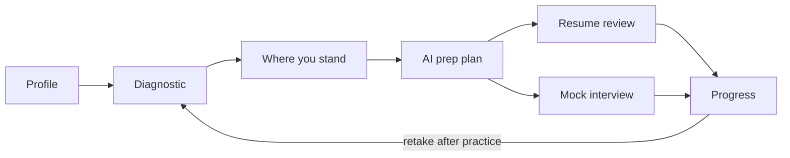
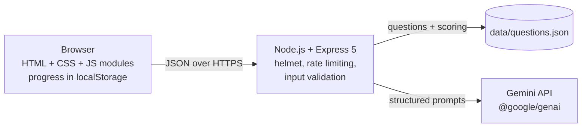

# Placement Navigator

**PromptWars × GDG On Campus – CIT · 26 September 2026**

> *Challenge:* many students struggle to understand **what to prepare, how to prepare, where they stand, and what they need to improve** for placements.

Placement Navigator is a web app that answers those four questions for each student. It checks where you stand, builds a plan from your weakest areas, and gives you feedback on your resume and interview answers.

## How it answers the challenge

| Student's question | What Placement Navigator does |
|---|---|
| **Where do I stand?** | A 20-question diagnostic (Aptitude, DSA, CS Fundamentals, Communication) scored on the server, with a score per area, strongest area and "focus first" area |
| **What should I prepare?** | Gemini builds a plan from *your* scores, target role, company type and hours per week |
| **How should I prepare?** | A week-by-week checklist and a daily habit, sized to the weeks left before your placement month |
| **Is my resume ready?** | Resume vs target-role review: match score, missing keywords and rewritten lines (only lines that really exist in your resume) |
| **Can I answer in an interview?** | Mock HR/Technical interviews with scores for relevance, structure, clarity and depth, a stronger version of your answer, and a filler-word counter; you can type or speak your answer |
| **Am I improving?** | Progress screen comparing each diagnostic with the previous one, interview averages, resume score change and plan completion |

## User flow



## How AI is used

The app makes four Gemini calls through the official `@google/genai` SDK. Each call sends a **system instruction** that sets the role and rules, and a **JSON schema** (`responseMimeType: application/json` + `responseJsonSchema`), so the model returns structured data the UI can render reliably.

| Feature | Endpoint | What the prompt asks for | Guard rails in code |
|---|---|---|---|
| Prep plan | `POST /api/plan` | Priorities, weekly plan, daily habit, practice ideas from profile + scores | Weeks left is calculated in code, not by the AI; the student's name is never sent; output is trimmed to the expected fields |
| Resume review | `POST /api/resume/review` | Match score, strengths, missing keywords, before/after lines, next steps | Emails and phone numbers are removed before sending; rewrites whose "before" text is not in the resume are dropped; score clamped to 0–100 |
| Interview question | `POST /api/interview/question` | One fresher-level HR or technical question, not repeating earlier ones | Previously asked questions are passed in |
| Interview feedback | `POST /api/interview/feedback` | 1–5 scores on relevance, structure (STAR), clarity, depth; what worked; what to improve; a better answer using only the student's facts | Scores clamped to 1–5; the answer is marked as data, not instructions |

**Computed without AI** (so it is fast, free and exact): diagnostic scoring, readiness level, strongest/weakest area, weeks until placements, word count, speaking time and filler words (*um, uh, like, basically, actually, you know, so*), progress changes and plan completion.

## Architecture



- **No database, no accounts.** A student's profile, results, plan and history stay in their own browser (`localStorage`), and the Progress screen has a "Clear my data" button.
- **The API key stays on the server.** It is read from `GEMINI_API_KEY` and never sent to the browser.
- **Correct answers stay on the server.** `GET /api/diagnostic/questions` sends questions without answers; scoring happens in `POST /api/diagnostic/score`.

## Security and quality

- `helmet` security headers, including a Content Security Policy (no inline scripts)
- AI endpoints limited to 20 requests per minute per client, all API routes to 120
- Every input validated (types, lengths, ranges, allowed values) with clear 400 messages
- Safe error responses: no stack traces or internal details reach the browser
- All AI and user text is inserted with `textContent` (no `innerHTML`), so it cannot inject HTML
- Accessible: labelled form fields, keyboard navigation, skip link, focus moves to each screen's heading, `aria-live` status messages, colour contrast of at least 5.4:1 for all text colours, and scores always shown as text, not colour alone
- Works on phones (tested at 375 px wide) and supports light and dark mode

## Run locally

Requires **Node.js 22.9 or newer**.

```bash
git clone https://github.com/bharathykannan6/GDG_Placement-navigator.git
cd GDG_Placement-navigator
npm install
cp .env.example .env        # then paste your key from https://aistudio.google.com/apikey
npm run dev
```

Open http://localhost:8080. Without a key the diagnostic, dashboard and progress screens still work; AI features show "AI is not configured".

| Variable | Required | Default | Purpose |
|---|---|---|---|
| `GEMINI_API_KEY` | for AI features | — | Gemini API key from Google AI Studio |
| `GEMINI_MODEL` | no | `gemini-flash-latest` | Gemini model ID |
| `PORT` | no | `8080` | Port to listen on (Cloud Run sets this) |

## Tests

```bash
npm test
```

28 tests use Node's built-in test runner and `supertest`. They cover:
- health, headers and 404s;
- the question bank and scoring;
- input validation;
- every AI route, using a fake model so no network or key is needed;
- redaction of contacts and dropping of invented rewrites;
- rate limiting and safe error handling;
- the pure scoring, filler-word and progress logic.

## Deploy to Google Cloud Run

From [Cloud Shell](https://shell.cloud.google.com) (or any machine with `gcloud`):

```bash
git clone https://github.com/bharathykannan6/GDG_Placement-navigator.git
cd GDG_Placement-navigator

gcloud config set project YOUR_PROJECT_ID
gcloud services enable run.googleapis.com cloudbuild.googleapis.com artifactregistry.googleapis.com secretmanager.googleapis.com

# Store the key as a secret
printf "%s" "PASTE_YOUR_GEMINI_KEY" | gcloud secrets create gemini-api-key --data-file=-

# Allow Cloud Run's default service account to read it
PROJECT_NUMBER=$(gcloud projects describe YOUR_PROJECT_ID --format="value(projectNumber)")
gcloud secrets add-iam-policy-binding gemini-api-key \
  --member="serviceAccount:${PROJECT_NUMBER}-compute@developer.gserviceaccount.com" \
  --role="roles/secretmanager.secretAccessor"

gcloud run deploy placement-navigator \
  --source . \
  --region asia-south1 \
  --allow-unauthenticated \
  --set-secrets GEMINI_API_KEY=gemini-api-key:latest \
  --set-env-vars GEMINI_MODEL=gemini-flash-latest
```

There is no Dockerfile: Cloud Run builds the app with Google Cloud's Node.js buildpack and starts it with `npm start`.

## Project structure

```
server.js                 starts the server on $PORT
src/
  app.js                  Express app: security, rate limits, routes, error handling
  gemini.js               generateJson() helper around @google/genai
  validate.js             input validation helpers
  routes/
    diagnostic.js         questions (without answers) and scoring
    plan.js               AI prep plan
    resume.js             AI resume review + contact redaction
    interview.js          AI interview questions and feedback
data/questions.json       20-question diagnostic bank with explanations
public/
  index.html, styles.css
  js/                     one module per screen, plus pure logic modules
                          (speech-stats.js, progress-stats.js) shared with tests
test/                     node:test suites
```

## Future scope

- Compare your readiness with your batch (anonymous percentiles)
- Company-specific question banks and past interview experiences
- Voice tone and pace analysis for mock interviews
- A placement-cell (TPO) dashboard across a whole class
- Larger, rotating diagnostic question banks with difficulty levels

## Team

- [bharathykannan6](https://github.com/bharathykannan6)
